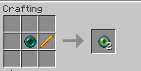
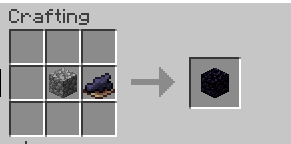
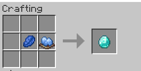
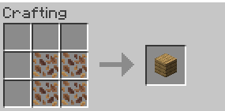
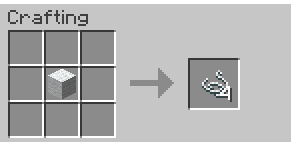
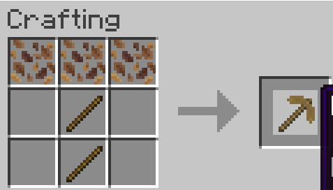
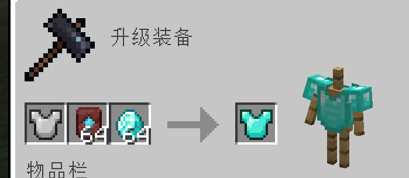
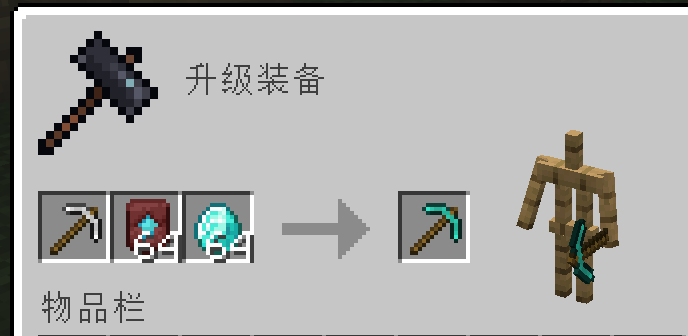

### Ttems tweaks
这是一个 Minecraft Fabric 模组，提供了一些物品使用和堆叠的调整功能。

## 功能特性

### 1. 末地传送门框架物品提取
- **功能**: 允许玩家空手潜行右键点击末地传送门框架来取出末影之眼
- **操作**: 右键点击已放置末影之眼的末地传送门框架
- **结果**: 末影之眼会掉落，可以从框架中移除

### 2. 物品堆叠数量调整
- **桶 (Bucket)**: 堆叠上限从 16 提升至 32
- **潜影盒 (Shulker Box)**: 
  - 空潜影盒堆叠上限提升至 64
  - 装有物品的潜影盒保持堆叠上限为 1（防止数据崩溃）
- **不死图腾 (Totem of Undying)**: 堆叠上限从 1 提升至 64
- **雪球(Snow Ball) 末影珍珠(Ender Pearl) 鸡蛋(Egg)**: 堆叠上限从 16 提升至 64

### 3. 物品合成配方
- **末影之眼合成**: 
  - 配方: 1 个末影珍珠 + 1 个烈焰棒
  - 产出: 2 个末影之眼

- **黑曜石合成**: 
  - 配方: 1 个圆石 + 1 个黑色染料
  - 产出: 1 个黑曜石

- **钻石合成**: 
  - 配方: 1 个青金石 + 1 个淡蓝色染料
  - 产出: 1 个钻石

- **橡木木板合成**:
  - 配方: 4 个枯叶
  - 产出: 1 个橡木木板

- **线合成**:
  - 配方: 1 个羊毛(任意颜色)
  - 产出: 4 个线

- **落叶镐合成**
  - 配方: 如图所示
  - 产出: 如图所示

## 模组截图
### 所有铁制装备/工具/武器都可以用这种方式升级为钻石制装备/工具/武器

## 技术实现

### Mixin 注入
- `ShulkerBoxMixin`: 修改潜影盒堆叠数量
- `TotemStackMixin`: 修改不死图腾堆叠数量
- `BucketStackMixin`: 修改桶堆叠数量
- `EndPortalFrameBlockMixin`: 实现末地传送门框架的末影之眼取出功能

### 数据生成
- `ObsidianRecipeGen`: 添加黑曜石合成配方
- `WoolToThreadRecipeGen`: 添加线合成配方
- `LeafLitterToPlanksRecipeGenerator`: 添加枯叶合成木板配方
- `EnderEyeRecipeGenerator`: 添加新的末影之眼合成配方
- `DiamondEquipmentForgingGen`: 添加钻石制物品锻造配方
- `DiamondRecipeGen`: 添加钻石合成配方

## 安装说明

1. 确保您的 Minecraft 版本为 1.21.11 并已安装 Fabric API
2. 将本模组文件放入 `.minecraft/mods` 目录
3. 启动游戏即可使用

## 依赖要求

- Minecraft 1.21.11
- Fabric Loader >= 0.15.0
- Java >= 21
- Fabric API

