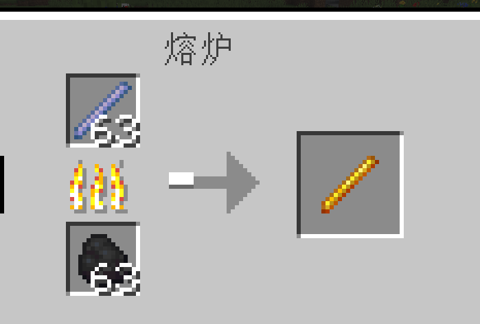

[](https://fabricmc.net)
[](https://minecraft.wiki/w/Java_Edition_1.21.11)


# Items Tweaks

## Introduction

Items Tweaks is a Minecraft Fabric mod that adds various item tweaks and new gameplay mechanics. This mod enhances the vanilla experience by introducing new item interactions, custom tools, and automated features.

---

## Features

### 1. Leaf Litter Fire System

When leaf litter item entities accumulate in the same block space and exceed 256 items, fire will automatically generate at that location to burn them. This feature helps prevent lag from excessive item entities and adds a realistic combustion mechanic.

- Detection frequency: Every 0.5 seconds
- Trigger threshold: 256 leaf litter items
- Fire spawns at: Leaf litter location

### 2. Obsidian Conversion

- Right-click obsidian with a water bottle to convert it to crying obsidian (water bottle becomes empty)
- Right-click crying obsidian with an empty bottle to convert it back to regular obsidian (empty bottle becomes water bottle)
- Allows free conversion between both types of obsidian

### 3. Cobblestone to Obsidian

Right-click cobblestone with black dye to convert it into obsidian. Consumes one black dye in survival mode.

### 4. Sweet Berries No Cooldown

Right-click sweet berries to eat them instantly without cooldown or eating animation. Works in both survival and creative modes.

### 5. Fire Charge Launcher

Right-click with a fire charge to launch it as a projectile instead of placing fire. The fire charge flies in the direction you're looking and explodes on impact, dealing damage and creating fire. Perfect for combat and demolition!

- Launch direction: Player's line of sight
- Explosion: Deals damage and creates fire on impact
- Works: Both when aiming at blocks and in the air
- Consumption: One fire charge per launch (except in creative mode)

### 6. Breeze Rod Smelting

Smelt a breeze rod in a furnace to obtain a blaze rod. This provides an alternative way to acquire blaze rods without visiting the Nether.

- Input: 1 Breeze Rod
- Output: 1 Blaze Rod
- Experience: 0.7 XP
- Smelting time: 200 ticks (10 seconds)

### 7. Riptide Trident Anywhere

Use a trident with the Riptide enchantment in any environment, without needing to be in water or rain. The mod automatically detects when you're holding a trident and allows the riptide effect to work anywhere.

- Works: In any environment (no water or rain required)
- Detection: Automatically checks if holding a trident
- Compatibility: Fully compatible with vanilla riptide mechanics
- Enchantment: Requires Riptide enchantment on trident

### 6. Custom Items

- **Leaf Litter Pickaxe**: Crafted with leaf litter, used for gathering leaf litter efficiently
- **Leaf Litter Sword**: Combat weapon made from leaf litter with 10 durability
- **Light Torch**: Enhanced lighting tool (not yet implemented)
- **Hard Snow Ball**: Compact snow ball with special properties (not yet implemented)

### 8. Crafting Recipes

- **Eye of Ender**:
  - Recipe: 1 Ender Pearl + 1 Blaze Rod
  - Output: 2 Eyes of Ender


- **Obsidian**:
  - Recipe: 1 Cobblestone + 1 Black Dye
  - Output: 1 Obsidian


- **Diamond**:
  - Recipe: 1 Lapis Lazuli + 1 Light Blue Dye
  - Output: 1 Diamond


- **Oak Planks**:
  - Recipe: 4 Leaf Litter
  - Output: 1 Oak Planks


- **String**:
  - Recipe: 1 Wool (any color)
  - Output: 4 String


- **Leaf Litter Pickaxe**:
  - Recipe: As shown in image
  - Output: As shown in image


- **Item Stacking**: Optimized stack limits for various items


- **Breeze Rod to Blaze Rod**: Smelt breeze rod in furnace to get blaze rod



---

## Installation

### Requirements

- Minecraft 1.21.11
- Fabric Loader
- Fabric API

### Steps

1. Install Minecraft Fabric Loader
2. Download Fabric API and place it in the `mods` folder
3. Download Items Tweaks mod jar file
4. Place the mod jar in the `mods` folder
5. Launch Minecraft with the Fabric profile

---

## Usage

### Leaf Litter Fire

1. Drop leaf litter items on the ground
2. Accumulate 128 or more leaf litter items in the same block space
3. Fire will automatically generate and burn the items
4. This prevents item entity lag and adds gameplay depth

### Obsidian Conversion

- Hold water bottle → Right-click obsidian → Get crying obsidian + empty bottle
- Hold empty bottle → Right-click crying obsidian → Get obsidian + water bottle

### Fire Charge Launcher

1. Hold a fire charge in your hand
2. Right-click to launch it (works both in air and when aiming at blocks)
3. The fire charge flies in your line of sight
4. Explodes on impact with entities or blocks
5. Explosion deals damage and creates fire
6. One fire charge is consumed per launch (except in creative mode)

### Breeze Rod Smelting

1. Obtain a breeze rod (dropped by Breeze mob)
2. Place the breeze rod in a furnace
3. Wait for smelting to complete (10 seconds)
4. Collect the blaze rod

### Riptide Trident Anywhere

1. Obtain a trident with Riptide enchantment
2. Long press right-click to charge in any environment (no water or rain needed)
3. Release right-click to launch and enjoy riptide flight
4. Fully compatible with all vanilla riptide mechanics

---

## Project Structure

```
Items-Tweaks/
├── src/main/java/io/qzz/iie/
│   ├── ItemsTweaks.java              # Main class
│   ├── datagen/                       # Data generation
│   │   └── BreezeRodSmeltingGen.java # Breeze rod smelting recipe
│   ├── events/                        # Event system
│   │   ├── LeafLitterFire.java       # Leaf litter fire
│   │   ├── WaterObsidian.java        # Obsidian conversion
│   │   ├── DyeCobblestoneToObsidian.java  # Cobblestone to obsidian
│   │   ├── NoCdEat.java              # No cooldown eat
│   │   └── RiptideAnywhere.java      # Riptide trident (placeholder)
│   ├── mixin/                         # Mixin injections
│   │   └── TridentRiptideMixin.java  # Riptide trident Mixin
│   └── newitems/                      # Custom items
│       ├── LeafLitterPickaxe.java    # Leaf litter pickaxe
│       ├── LeafLitterSword.java      # Leaf litter sword
│       ├── LightTorch.java           # Light torch
│       └── HardSnowBall.java         # Hard snow ball
└── build.gradle                       # Build configuration
```

---

## Development & Build

```bash
# Build the mod
./gradlew build

# Run in development environment
./gradlew runClient
```

Compiled jar file location: `/build/libs/items-tweaks-<version>.jar`


---

## Contributing

Contributions are welcome! Please feel free to submit issues and pull requests.

---

## License

This project is licensed under the MIT License - see the [LICENSE](LICENSE) file for details.

---

## Support

If you enjoy this mod, please consider giving it a ⭐ on GitHub!

---

Thank you for using Items Tweaks! Enjoy your enhanced Minecraft experience! 🎮


# 物品微调模组

## 简介

Items Tweaks 是一个 Minecraft Fabric 模组,为游戏添加了多种物品调整和新的游戏机制。该模组通过引入新的物品交互、自定义工具和自动化功能来增强原版游戏体验。

---

## 功能特性

### 1. 枯叶自燃系统

当枯叶物品实体在同一方块空间内堆积并超过256个时,会自动在该位置生成火焰将其烧毁。此功能有助于防止过多物品实体导致的卡顿,并添加了真实的燃烧机制。

- 检测频率: 每0.5秒
- 触发阈值: 256个枯叶物品
- 火焰生成位置: 枯叶物品所在位置

### 2. 黑曜石转换

- 用水瓶右键黑曜石可将其转换为哭泣的黑曜石(水瓶变为空瓶)
- 用空瓶右键哭泣的黑曜石可将其转换为普通黑曜石(空瓶变为水瓶)
- 实现两种黑曜石之间的自由转换

### 3. 圆石变黑曜石

使用黑色染料右键圆石可将其转换为黑曜石。在生存模式下会消耗一个黑色染料。

### 4. 甜浆果无冷却食用

右键甜浆果即可立即食用,无冷却时间且无进食动画。在生存和创造模式下均可使用。

### 5. 烈焰弹发射器

右键烈焰弹可以将其作为抛射物发射出去,而不是放置火焰。烈焰弹会沿你的视线方向飞行,击中目标后爆炸,造成伤害并生成火焰。非常适合战斗和破坏!

- 发射方向: 玩家视线方向
- 爆炸效果: 击中后造成伤害并生成火焰
- 使用方式: 对准方块或空中均可发射
- 消耗: 每次发射消耗一个烈焰弹(创造模式除外)

### 6. 旋风棒熔炼

在熔炉中熔炼旋风棒可以获得烈焰棒。这提供了一种无需前往下界就能获得烈焰棒的替代方式。

- 输入: 1 个旋风棒
- 产出: 1 个烈焰棒
- 经验: 0.7 XP
- 熔炼时间: 200 tick (10秒)

### 7. 激流三叉戟无水使用

在任何环境下都能使用带有激流附魔的三叉戟,无需在水中或雨天。模组会自动检测玩家是否手持三叉戟,并允许在任何地方使用激流效果。

- 使用环境: 任意环境(无需水或雨)
- 检测方式: 自动检测是否手持三叉戟
- 兼容性: 完全兼容原版激流机制
- 附魔要求: 三叉戟需要带有激流附魔

### 6. 自定义物品

- **落叶镐**: 用枯叶制作,用于高效收集枯叶
- **落叶剑**: 用枯叶制作的战斗武器,耐久度为10
- **发光火把**: 增强型照明工具(暂时未实现)
- **硬雪球**: 具有特殊属性的压缩雪球(暂时未实现)

### 8. 物品合成配方

- **末影之眼合成**:
  - 配方: 1 个末影珍珠 + 1 个烈焰棒
  - 产出: 2 个末影之眼


- **黑曜石合成**:
  - 配方: 1 个圆石 + 1 个黑色染料
  - 产出: 1 个黑曜石


- **钻石合成**:
  - 配方: 1 个青金石 + 1 个淡蓝色染料
  - 产出: 1 个钻石


- **橡木木板合成**:
  - 配方: 4 个枯叶
  - 产出: 1 个橡木木板


- **线合成**:
  - 配方: 1 个羊毛(任意颜色)
  - 产出: 4 个线


- **落叶镐合成**:
  - 配方: 如图所示
  - 产出: 如图所示


- **物品堆叠**: 优化了多种物品的堆叠上限


- **旋风棒熔炼**: 在熔炉中熔炼旋风棒获得烈焰棒


---

## 安装说明

### 前置要求

- Minecraft 1.21.11
- Fabric Loader
- Fabric API

### 安装步骤

1. 安装 Minecraft Fabric Loader
2. 下载 Fabric API 并放入 `mods` 文件夹
3. 下载 Items Tweaks 模组 jar 文件
4. 将模组 jar 放入 `mods` 文件夹
5. 使用 Fabric 配置启动 Minecraft

---

## 使用方法

### 枯叶自燃

1. 将枯叶物品丢在地上
2. 在同一方块空间内堆积128个或更多枯叶物品
3. 火焰会自动生成并烧毁物品
4. 这可以防止物品实体卡顿并增加游戏深度

### 黑曜石转换

- 手持水瓶 → 右键黑曜石 → 获得哭泣黑曜石 + 空瓶
- 手持空瓶 → 右键哭泣黑曜石 → 获得黑曜石 + 水瓶

### 烈焰弹发射器

1. 手持烈焰弹
2. 右键发射(对准方块或空中均可)
3. 烈焰弹沿视线方向飞行
4. 击中实体或方块后爆炸
5. 爆炸造成伤害并生成火焰
6. 每次发射消耗一个烈焰弹(创造模式除外)

### 旋风棒熔炼

1. 获取旋风棒(从旋风人掉落)
2. 将旋风棒放入熔炉
3. 等待熔炼完成(10秒)
4. 获得烈焰棒

### 激流三叉戟无水使用

1. 获取带有激流附魔的三叉戟
2. 在任何环境下(无需水或雨)长按右键蓄力
3. 松开右键发射,享受激流飞行
4. 完全兼容原版激流的所有机制

---


## 项目结构

```
Items-Tweaks/
├── src/main/java/io/qzz/iie/
│   ├── ItemsTweaks.java              # 主类
│   ├── datagen/                       # 数据生成
│   │   └── BreezeRodSmeltingGen.java # 旋风棒熔炼配方
│   ├── events/                        # 事件系统
│   │   ├── LeafLitterFire.java       # 枯叶自燃
│   │   ├── WaterObsidian.java        # 黑曜石转换
│   │   ├── DyeCobblestoneToObsidian.java  # 圆石变黑曜石
│   │   ├── NoCdEat.java              # 无冷却食用
│   │   └── RiptideAnywhere.java      # 激流三叉戟(占位)
│   ├── mixin/                         # Mixin注入
│   │   └── TridentRiptideMixin.java  # 激流三叉戟Mixin
│   └── newitems/                      # 自定义物品
│       ├── LeafLitterPickaxe.java    # 落叶镐
│       ├── LeafLitterSword.java      # 落叶剑
│       ├── LightTorch.java           # 发光火把
│       └── HardSnowBall.java         # 硬雪球
└── build.gradle                       # 构建配置
```

---

## 开发与构建

```bash
# 构建模组
./gradlew build

# 在开发环境中运行
./gradlew runClient
```

编译后的jar文件位于: `/build/libs/items-tweaks-<version>.jar`


---

## 贡献

欢迎贡献!请随时提交 issue 和 pull request。

---

## 许可证

本项目采用 MIT 许可证 - 详见 [LICENSE](LICENSE) 文件。

---

## 支持

如果你喜欢这个模组,请考虑在 GitHub 上给它一个 ⭐!

---

感谢使用 Items Tweaks!祝你享受增强的 Minecraft 游戏体验! 🎮
